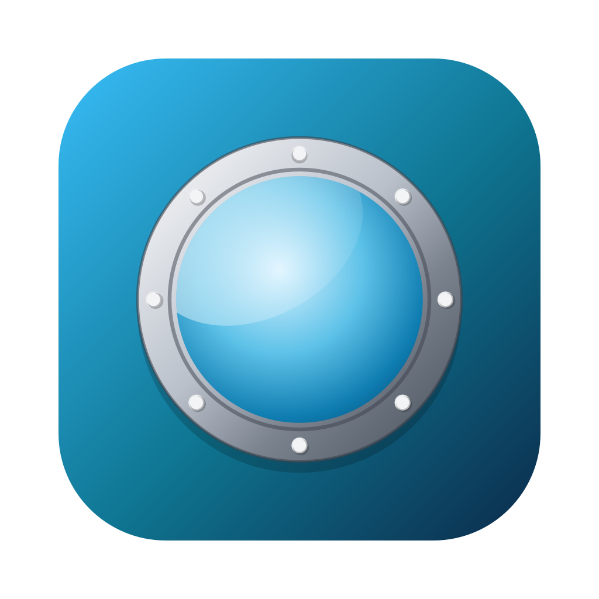
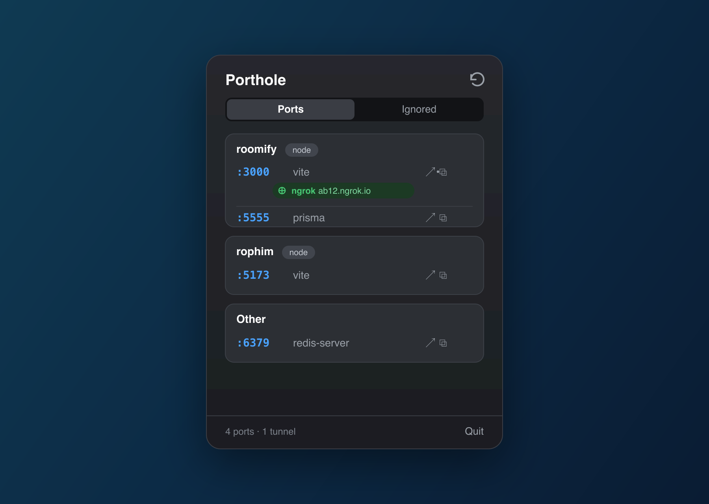

<div align="center">



# Porthole

**在菜单栏中直接查看哪些开发端口正在运行、每个端口属于哪个项目，以及哪些隧道指向何处。**

[](https://github.com/ntd4996/Porthole/actions/workflows/ci.yml)
[](https://github.com/ntd4996/Porthole/releases/latest)
[](https://github.com/ntd4996/Porthole/releases/latest)
[](LICENSE)

[English](README.md) · [Tiếng Việt](README.vi.md) · **中文**



</div>

## 它能做什么

当你在多个项目中同时运行十几个开发服务器时，手动敲 `lsof -i` 很快就会让人厌烦。Porthole 在菜单栏中保持一份实时列表：

- **正在运行的开发端口** 以及每个端口背后的进程（`vite`、`next`、`prisma`、`uvicorn`…）。
- **哪个项目拥有该端口**，依据进程的工作目录解析（git 根目录 / `package.json` / `go.mod` / `pyproject.toml`…），并按项目分组。
- **指向端口的隧道**，从 ngrok、Cloudflare Tunnel、Tailscale 和 localtunnel 中检测，公开 URL 一键直达。
- **每个端口的快捷操作**：在浏览器中打开 `localhost:PORT`、复制 URL，或结束进程。
- **忽略列表**，用于隐藏嘈杂的系统服务（ControlCenter、rapportd…），让你只关注真正的开发端口。内置合理默认值，完全可编辑。

## 安装

### Homebrew（推荐）

```bash
brew install --cask ntd4996/tap/porthole
```

### 直接下载

从 [发布页面](https://github.com/ntd4996/Porthole/releases/latest) 获取最新的已签名并公证的 `.dmg`，打开它，然后把 Porthole 拖到 Applications。

Porthole 驻留在菜单栏（没有 Dock 图标）。点击 porthole 图标即可打开面板。

## 工作原理

Porthole 调用标准工具并解析它们的输出，无需内核扩展，无需提权：

- 用 `lsof -nP -iTCP -sTCP:LISTEN` 查找监听中的套接字，用 `lsof … -d cwd` 查找每个进程的目录。
- 用 ngrok 本地 API（`127.0.0.1:4040`）、`cloudflared` / `lt` 命令行、`~/.cloudflared/config.yml` 以及 `tailscale serve status` 检测隧道。公开 URL 为尽力而为（Cloudflare 快速隧道的 URL 并非总是可用）。

它不使用沙盒（运行 `lsof`/`ps` 所必需），并以经过公证的 Developer ID 构建分发。

## 从源码构建

```bash
git clone https://github.com/ntd4996/Porthole.git
cd Porthole
swift build
swift test
swift run porthole          # 运行菜单栏应用
./scripts/build-app.sh      # 生成 build/Porthole.app
```

需要 macOS 14+ 和较新的 Swift 工具链。检测逻辑位于 `PortholeCore` target（纯逻辑，有单元测试）；SwiftUI 菜单栏界面位于 `porthole` target。

## 许可证

[MIT](LICENSE) © Dat Nguyen
